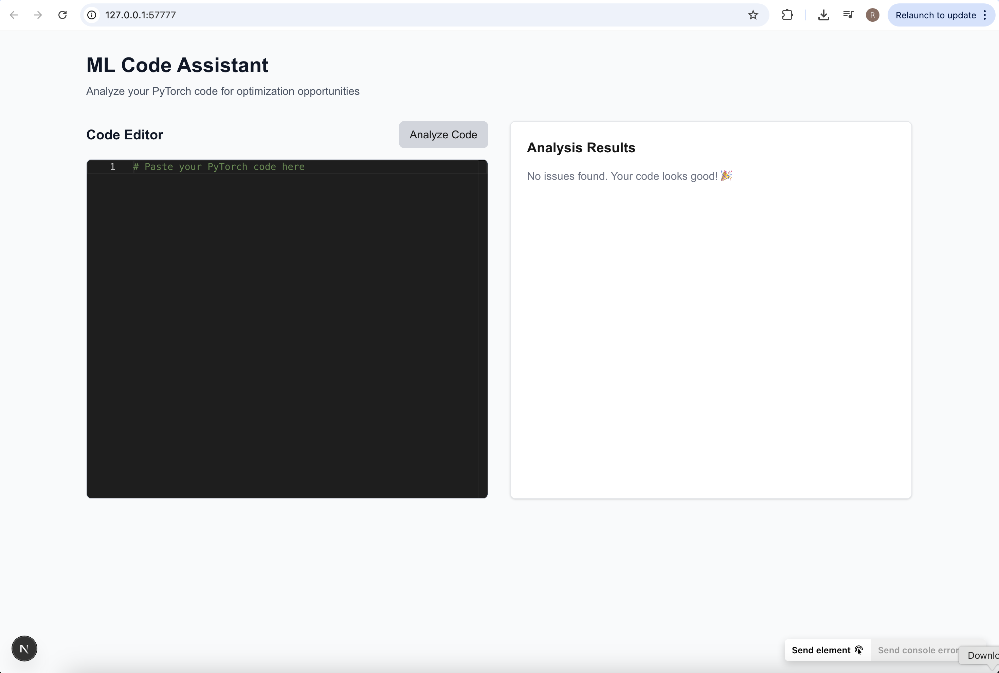
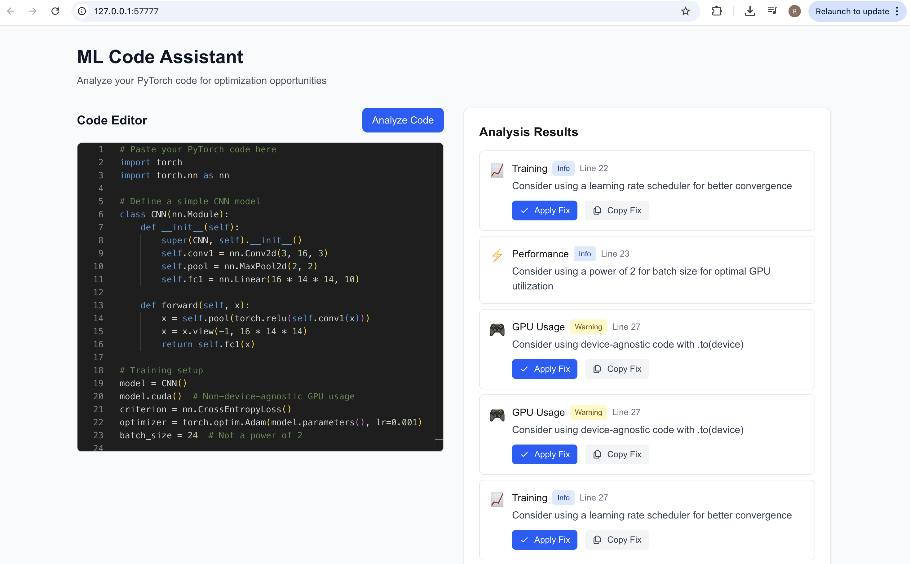

# TorchGuard

## The Problem

When developing deep learning models, it's easy to overlook critical performance optimizations and best practices. Common issues include:

- Inefficient GPU memory usage that could lead to OOM errors
- Unnecessary gradient computations during inference
- Memory leaks from not clearing gradients
- Suboptimal batch sizes affecting training speed
- Missing performance improvements from learning rate scheduling

This tool automatically identifies these issues in your PyTorch code and suggests improvements, helping you write more efficient and robust deep learning applications.

## Features

✨ **Automatic Code Analysis**: Scans your code for common performance pitfalls  
🚀 **One-Click Fixes**: Apply suggested optimizations with a single click  
🎯 **Best Practices**: Learn better coding patterns through actionable feedback  
💡 **Educational**: Understand why each optimization matters  

## Screenshots

### Initial View

*The clean interface allows you to paste your PyTorch code and analyze it with one click.*

### Analysis Results

*The analyzer identifies optimization opportunities and provides actionable fixes.*

## Technical Implementation

### Backend Architecture (Rust)

The backend is built with Rust for high performance and reliability, featuring:

#### 1. Code Analysis Engine
- **Tree-sitter Integration**: Uses Tree-sitter for robust Python code parsing
- **Pattern Matching**: Custom query system to identify common ML code patterns
- **AST Analysis**: Traverses the Abstract Syntax Tree to detect optimization opportunities

#### 2. Optimization Patterns
The analyzer checks for several critical patterns:
```rust
pub struct Finding {
    category: String,    // e.g., "GPU Usage", "Training", "Model State"
    message: String,     // User-friendly explanation
    line: i32,          // Location in code
    severity: String,    // Importance level
    fix: Option<Fix>,   // Suggested code improvement
}
```

#### 3. Smart Fixes
- Device-agnostic GPU usage
- Gradient management
- Memory optimization
- Model state handling
- Performance improvements

### Frontend Stack (Next.js)

Built with modern web technologies:
- **Next.js**: For server-side rendering and optimal performance
- **Monaco Editor**: VS Code-like editing experience
- **Tailwind CSS**: Clean, responsive design
- **TypeScript**: Type-safe code
- **Real-time Analysis**: Instant feedback on code changes

### API Design

RESTful API endpoints:
```rust
POST /analyze
- Accepts PyTorch code
- Returns optimization findings
- Supports batch analysis

GET /health
- Service health check
- Backend status monitoring
```

### Implementation Details

#### Rust Backend
```rust
// Core analyzer using Tree-sitter for parsing
pub struct CodeAnalyzer {
    parser: Parser,
    query: Query,
}

// Findings returned to frontend
pub struct Finding {
    category: String,    // Type of optimization
    message: String,     // What needs to be fixed
    line: i32,          // Where to fix it
    severity: String,    // How important it is
    fix: Option<Fix>,    // How to fix it
}
```

#### Vector Search with Qdrant
- Store code patterns and optimizations in Qdrant
- Semantic search for similar code patterns
- Fast retrieval of relevant fixes

#### LLM Integration with Ollama
- Generate detailed explanations for fixes
- Provide context-aware optimization suggestions
- Help understand performance implications

#### Key Features
1. **Pattern Detection**
   - Direct GPU usage (`.cuda()`)
   - Missing gradient zeroing
   - Inference mode checks
   - Batch size optimization

2. **Smart Fixes**
   - Device-agnostic code
   - Memory optimization
   - Training best practices

## Project Structure

- `/src` - Rust backend for code analysis
- `/ml-code-assistant` - Next.js frontend

## Prerequisites

- Rust (latest stable)
- Node.js (v18 or later)
- npm
- Qdrant (vector database)
- Ollama (local LLM)

### Setting up Dependencies

1. **Install Qdrant**:
```bash
curl -L https://qdrant.io/install.sh | bash
```

2. **Install Ollama**:
```bash
curl https://ollama.ai/install.sh | sh
```

## Getting Started

### Backend Setup

1. Navigate to the root directory:
```bash
cd rust-llm-qdrant
```

2. Run the Rust backend:
```bash
cargo run
```

The backend will start on http://localhost:3003

### Frontend Setup

1. Navigate to the frontend directory:
```bash
cd ml-code-assistant
```

2. Install dependencies:
```bash
npm install
```

3. Start the development server:
```bash
npm run dev
```

The frontend will be available at http://localhost:3001

## Usage

1. Open http://localhost:3001 in your browser
2. Paste your PyTorch code into the editor
3. Click "Analyze Code"
4. Review the suggestions in the right panel
5. Apply fixes by clicking "Apply Fix" on any suggestion

## Example Code

Here's a sample code snippet to test the analyzer:

```python
import torch
import torch.nn as nn

# Define a simple CNN model
class CNN(nn.Module):
    def __init__(self):
        super(CNN, self).__init__()
        self.conv1 = nn.Conv2d(3, 16, 3)
        self.pool = nn.MaxPool2d(2, 2)
        self.fc1 = nn.Linear(16 * 14 * 14, 10)

    def forward(self, x):
        x = self.pool(torch.relu(self.conv1(x)))
        x = x.view(-1, 16 * 14 * 14)
        return self.fc1(x)

# Training setup
model = CNN()
model.cuda()  # Non-device-agnostic GPU usage
criterion = nn.CrossEntropyLoss()
optimizer = torch.optim.Adam(model.parameters(), lr=0.001)
batch_size = 24  # Not a power of 2

# Training loop
for epoch in range(10):
    for data, target in train_loader:
        data = data.cuda()  # Non-device-agnostic GPU usage
        target = target.cuda()
        
        # Missing optimizer.zero_grad()
        output = model(data)
        loss = criterion(output, target)
        loss.backward()
        optimizer.step()

# Inference
for data, target in test_data:
    # Missing model.eval() and torch.no_grad()
    output = model(data.cuda())
    predictions = output.max(1)[1]
```

## Roadmap

🚧 **Coming Soon**

### Infrastructure
- CI/CD pipeline with AWS infrastructure
- Automated testing and deployment
- Scalable backend architecture

### Advanced Analysis
- Distributed training optimization suggestions
- Multi-GPU data parallelism best practices
- Mixed precision training recommendations
- Gradient accumulation for large models
- Memory-efficient attention patterns
- Transformer architecture optimizations

### Performance Monitoring
- Real-time memory usage tracking
- GPU utilization analysis
- Training throughput optimization
- Bottleneck identification
- Hardware-specific tuning suggestions

## Contributing

Feel free to submit issues and enhancement requests!
